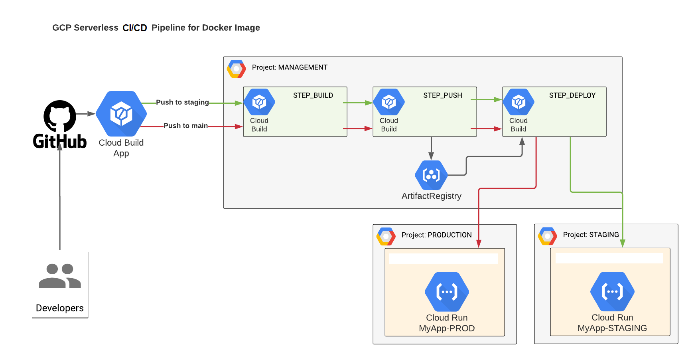

## DockerImage Build, Push and Deploy to GCP Cloud Run via GCP Cloud Build

  

In order to deploy via Cloud Build located in project MANAGEMENT (SHARED SERVICES) (SHARED SERVICES) to CloudRun located in project STAGE,PROD you will need:

1. In project MANAGEMENT (SHARED SERVICES), get email of account for `xxxxxxxx@cloudbuild.gserviceaccount.com`
2. In project STAGE and PROD add this account as princial into IAM and add Roles:

     | IAM Role Name         | IAM Role Permission             |
     |-----------------------|---------------------------------|
     | Cloud Run Admin       | `roles/run.admin`               |  
     | Service Account User  | `roles/iam.serviceAccountUser`  |

In order to CloudRun located in project STAGE and PROD to <b>PULL</b> docker images from Artifact Registry located in project MANAGEMENT (SHARED SERVICES) you will need:
1. In project STAGE and PROD get email of account `service-xxxxx@serverless-robot-prod.iam.gserviceaccount.com`
2. In project MANAGEMENT (SHARED SERVICES) in permissions of Artifact Registry Repository, add princial from Step-1 with the following role:
   - Artifact Registry Reader - `roles/artifactregistry.reader`

In order to CloudBuild located in project MANAGEMENT (SHARED SERVICES) to <b>PUSH</b> docker images to Artifact Registry located in project MANAGEMENT (SHARED SERVICES) you will need:
1. In project MANAGEMENT (SHARED SERVICES) get email of account `xxxxxxxx@cloudbuild.gserviceaccount.com`
2. In project MANAGEMENT (SHARED SERVICES) in permissions of Artifact Registry Repository, add princial from Step-1 with the following role:
   - Artifact Registry Writer - `roles/artifactregistry.writer`

## Copyleft (c) by Michael Kravtsiv
